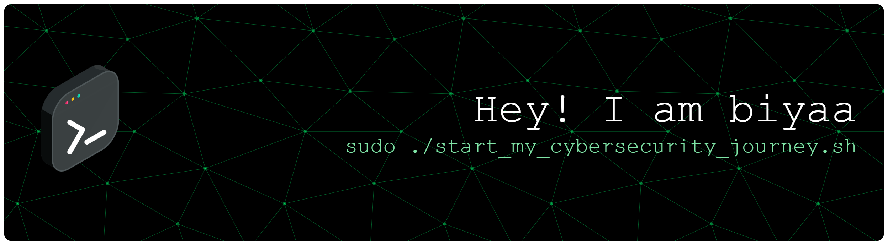

## Hi there 👋

<!--
<!-- **sitirobiah/sitirobiah** is a ✨ _special_ ✨ repository because its `README.md` (this file) appears on your GitHub profile. -->

Hi there, I'm Biya 👋

🎓 Informatics Engineering Student  
🔐 Aspiring Cybersecurity Professional  
🐧 Currently learning Linux, Networking & Cybersecurity  
🎯 Interested in Red Teaming, Ethical Hacking & CTFs  
🌏 Based in Singapore

---

## 👩‍💻 About Me

I'm an Informatics Engineering student who is currently building my
foundation in cybersecurity.

My journey into cybersecurity started from learning the fundamentals
of computer networks, security principles, Linux, and ethical hacking.

I'm still at the beginning of my journey, so I'm focusing on
understanding the fundamentals, practicing consistently, and building
real hands-on experience.

I'm especially interested in:

- 🔴 Red Teaming
- 🛡️ Ethical Hacking
- 🌐 Network Security
- 🐧 Linux
- 🕵️ Web Security
- 🧩 Capture The Flag (CTF)
- 🔐 Information Security

My goal is to become a cybersecurity professional and eventually
work in an international environment.

---

## 📚 Currently Learning

### Cybersecurity
- Security Fundamentals
- CIA Triad
- Authentication & Authorization
- Access Control
- Risk Management
- Incident Response
- Network Security
- Cloud Security Fundamentals
- Cryptography Fundamentals

### Networking
- TCP/IP
- OSI Model
- IP Addressing
- Subnetting
- VLAN
- DMZ
- Firewalls
- Network Topology
- Wireshark
- Nmap

### Linux & Security Tools
- Linux / Kali Linux
- Bash basics
- Nmap
- Wireshark
- Burp Suite
- Zenmap

### Programming
- Python
- Basic programming concepts
- Basic scripting

---

## 🧪 Hands-on Learning

I'm currently building my practical cybersecurity skills through:

- 🧩 TryHackMe
- 🏴 Capture The Flag (CTF)
- 🐧 Kali Linux labs
- 🔎 Network analysis
- 🌐 Web security labs
- 🛠️ Small cybersecurity projects

I believe cybersecurity is not only about collecting certifications,
but also about understanding how things work and practicing them.

---

## 📜 Learning & Certifications

### Completed Learning

- 🎓 CS50's Introduction to Cybersecurity — Harvard
- 🌐 Introduction to Cybersecurity — Cisco Networking Academy

- 🐍 Dicoding — Memulai Pemrograman dengan Python

### Currently Building Toward

- ISC2 Certified in Cybersecurity (CC)
- Networking fundamentals
- Linux fundamentals
- Web security
- Penetration testing fundamentals

---

## 🗂️ My Cybersecurity Learning Journey

I'm documenting my learning process here so I can see my progress
from beginner to cybersecurity professional.
